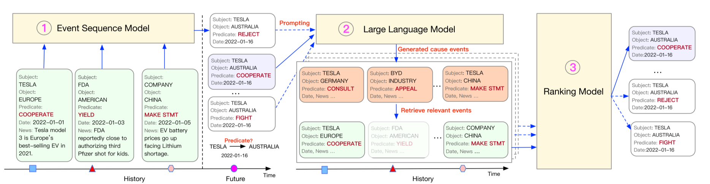
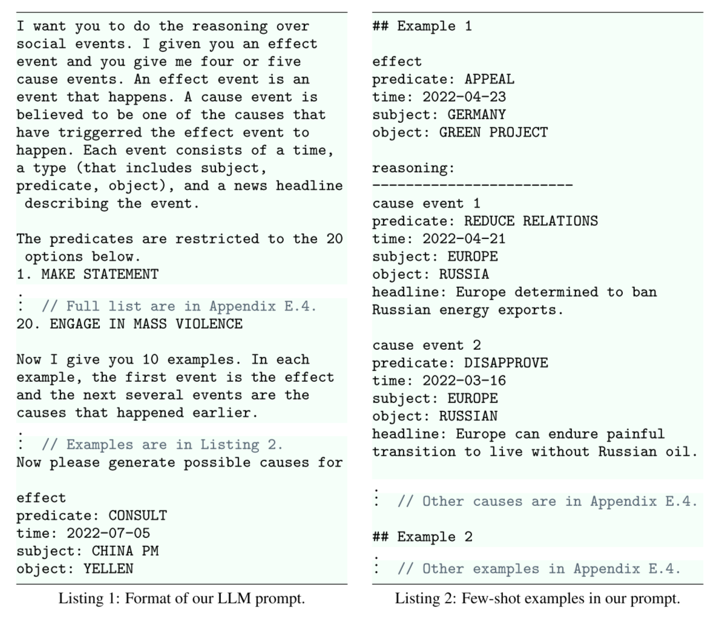
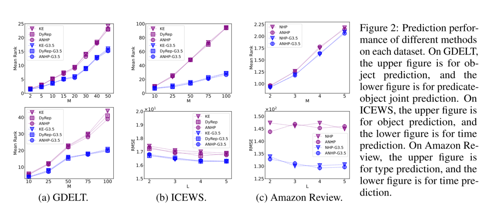
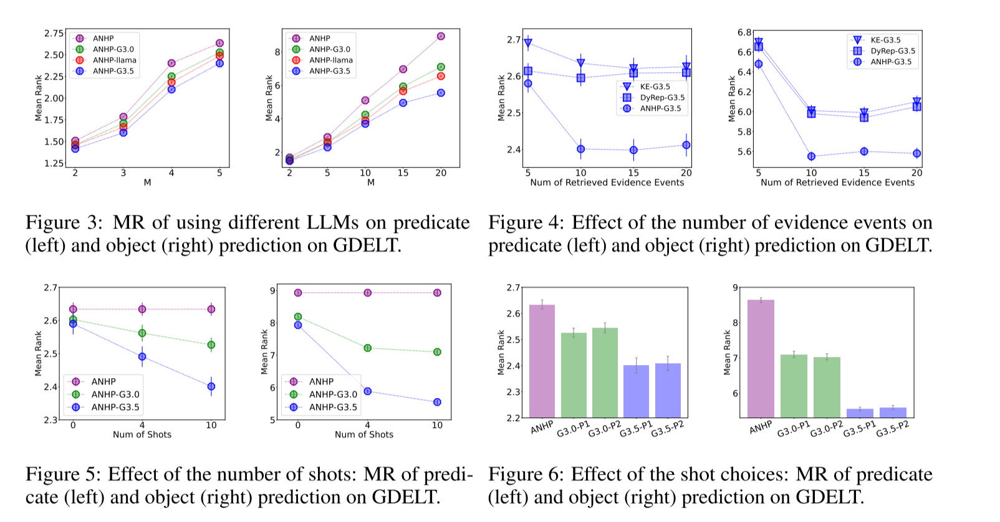
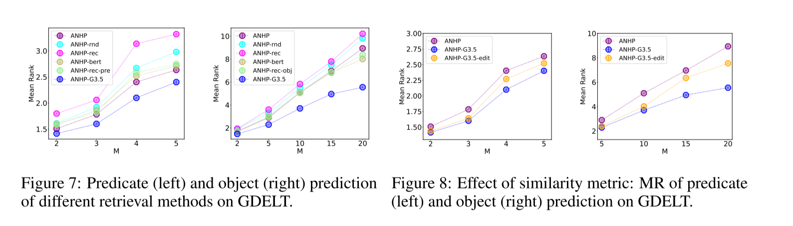

# Language Models Can Improve Event Prediction by Few-Shot Abductive Reasoning
NeurIPS 2023，第三十七届神经信息处理系统年会，2023 年 12 月 10 日至 16 日

语言模型可以通过少量溯因推理改进事件预测

> 设计了一个基于大型语言模型的LAMP框架勇于实践预测，
>
> 基于结果事件对原因事件进行预测，并通过评分函数计算预测的准确性

在本文中，我们研究了它们在现实世界事件推理和改进事件预测方面的能力。我们特别关注时间戳事件序列的建模问题，以及在给定过去的情况下预测未来事件的问题

> 文章思想：本文与逻辑推理的研究密切相关，逻辑推理主要侧重于从已知的事实和规则中证明目标。解决这个问题的一个主要方法是向后链接:它从目标向后工作，通过规则链接找到支持证明的已知事实(Russell & Norvig, 2010)。这种方法已被应用于各种应用问题，包括自然语言中的推理和规划(Ye et al.， 2022;Weir & Van Durme, 2022;Kazemi et al.， 2023;Kassner et al.， 2023)。在我们的设置中，每个提议的事件都被视为目标，之前的事件作为已知的事实。与向后链接一样，我们的方法识别支持提案的先前事件。但是我们的方法只执行一个推理步骤，假设所有事件都是可观察到的完整数据。推理的第二步是不必要的，因为直接原因是可观察到的，而且比间接原因在时间上更近。在数据不完整的情况下，可能需要多个推理步骤来确定间接原因。处理不完整的数据将是我们当前框架的一个重要扩展，我们将把它留给未来的研究。

第一个将大型语言模型集成到事件序列建模中



## Problem Formulation and Technical Background

Event sequence modeling.事件序列算法的建模

Rich text information.  每个事件中都有属于自己的文本标记，包含事件的额外信息但是事件序列模型无法利用

Large language models.目前事件序列模型无法获取大语言模型的数据

## LAMP: Large Language Model in Event Prediction 

使用LLM来增强事件序列模型的预测过程

框架:
基础的事件序列模型：经过预训练并提出候选预测

大语言模型：执行溯源推理 逻辑推理形式，为给定的观察寻找最合理的解释(Russell & Norvig, 2010)。特别是，语言模型读取每个提出的预测，并为其建议可能的原因事件。然后，我们将每个llm生成的原因与历史中实际的先前事件进行模式匹配，并检索最相似的事件

ranking model ：计算候选预测及检索事件的组合

由结果事件倒推原因事件

## Experimental Setup

dataset GDELT ICEWS Amazon Review

four state-of-the-art event sequence models：NHP Know-Evovle (KE) DyRep ANHP

three strong LLMs：GPT-3-davinci GPT-3.5-turbo Llama-2-chat

实验结果



图2:不同方法在每个数据集上的预测性能。在GDELT上，上图用于对象预测，下图用于谓词对象联合预测。在ICEWS中，上图为目标预测，下图为时间预测。在Amazon Review上，上面的数字是类型预测，下面的数字是时间预测。

采用的评价指标：我们的主要评价指标是平均排名(MR)。这个指标有一个简单的解释:给定一个已排序的建议预测列表，它测量列表中基本真实类型的平均排名;较小的MR意味着更高的排名，从而获得更好的结果(例如，MR = 1意味着“平均排名最高”)。我们还使用了平均倒数秩(MRR)，它的可解释性较差，但对坏预测比mr更稳健。




相同基准模型和不同llms模型之间的对比图三

在我们的GDELT实验中，我们为每个提出的预测改变了检索证据事件的数量图四

提示符的设计图五  示例替换的敏感性图六

llms自身强大的泛化能力 LAMP框架也有着广泛应用的潜力



不使用llms的检索方法与使用llms实验结果对比图7

## 代码

step1

使用ANHP模型 《Neural Hawkes Process: A Neurally Self-Modulating Multivariate Point Process》

输入数据：

```json
{
    'num_entity': 2279,
    'num_rel': 20,
    'data': [
        (72, 26, 3, 0.0, 'event headline:Biden to Speak with Zelenskiy, Says He Warned Putin on Ukraine; event type:CONSULT; event time:2022-01-01; subject name:CANADA; object name:ITALY.')
    ]
}
```

seq_subject

seq_object

seq_relation

seq_time

输出数据：

```json
{
    'pred_relation': array([
        [1738.884 , 1677.9537, 1577.8158, 1876.4227, 1565.1388, 1343.2068,
         1579.8771, 1400.8088, 1408.3884, 1112.7982, 1570.1876, 1283.9198,
         1299.1256, 1106.044 , 1271.7788, 1343.5652, 1642.5164, 1278.0194,
         1474.5947, 1208.2157]
    ], dtype=float32),
    'pred_object': array([
        [1.4274734e+03, 1.4274320e+03, 1.4267902e+03, ..., 1.4264573e+03,
         1.4264470e+03, 6.8588269e+24]
    ], dtype=float32),
    'pred_rel_obj': [
        {'pred_relation': array([3], dtype=int64), 'pred_object': array([2175], dtype=int64), 'pred_score': array([2.7027592e+33], dtype=float32)},
        {'pred_relation': array([3], dtype=int64), 'pred_object': array([516], dtype=int64), 'pred_score': array([1.1979491e+33], dtype=float32)},
        {'pred_relation': array([3], dtype=int64), 'pred_object': array([329], dtype=int64), 'pred_score': array([8.415191e+32], dtype=float32)},
        {'pred_relation': array([3], dtype=int64), 'pred_object': array([525], dtype=int64), 'pred_score': array([5.9117014e+32], dtype=float32)},
        {'pred_relation': array([3], dtype=int64), 'pred_object': array([191], dtype=int64), 'pred_score': array([5.778935e+32], dtype=float32)},
        {'pred_relation': array([3], dtype=int64), 'pred_object': array([222], dtype=int64), 'pred_score': array([5.6909833e+32], dtype=float32)}
    ]
}

```

pred_relation : 关系概率分数

数组中的每个值（如1738.884）表示模型对某个特定关系类型的置信度分数。这些分数反映了模型认为这种关系在未来发生的可能性。

pred_object: 实体概率分数

pred_rel_obj:列表中的每个字典包含了具体的关系和对象的索引（如`pred_relation`中的3和`pred_object`中的2175），以及它们的置信度分数（如2.7027592e+33）。这些索引指向具体的关系类型和对象，而置信度分数表示模型对这些组合的预测信心。

original_idx = model_output['original_idx']
original_event = event_seq[original_idx]
