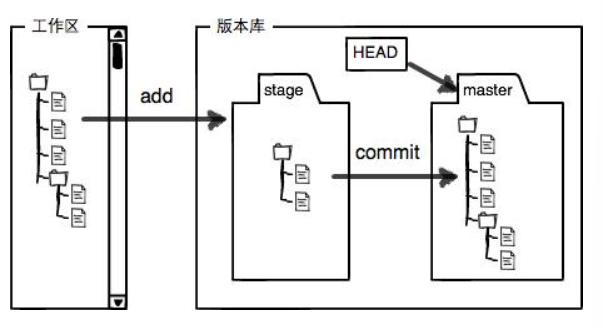
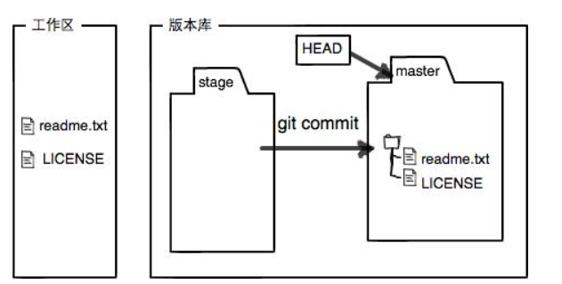

### git add <file>

​	git add . #一次性添加所有的改动

### git commit -m <message> #message是当此提交的说明

### git status 查看工作区的状态

### git diff 查看修改的内容

```python
>git diff
diff --git a/requirements.txt b/requirements.txt
index 96843d6..a12f37d 100644
#文件路径及索引
--- a/requirements.txt
+++ b/requirements.txt
#文件比较部分 --- 表示旧版本 +++ 表示新版本
@@ -1,2 +1,3 @@
 numpy==1.23.4
 pytorch_crf==0.7.2
#-1,2 旧版本：第一行开始的2行，+1,3 新版本：第一行开始的三行
+第二次修改
#+表示新增的行
\ No newline at end of file
```

### git log 展示从最近到最远的提交日志

```
commit b40105eb9107777ea098079efb84c48ea461e92b (HEAD -> master)
Author: zisui <wangser.cn@gmail.com>
Date:   Thu Jun 13 20:11:42 2024 +0800

    第二次修改
```

​	git log --pretty=oneline #一行展示提交日志，更加简洁

```
b40105eb9107777ea098079efb84c48ea461e92b (HEAD -> master) 第二次修改
```

​	b40105e......是commit  id版本号 ，svn是1，2，3，4......（git是分布式版本管理）

git log输出会在less分页器中显示按'**q**'退出

### git reset --hard commit_id（~1）回退版本

### git reflog 查看命令历史，帮助重返未来

### 工作区（Working Directory）电脑能看到的目录

### 版本库（Repository） .git 隐藏目录为版本库，包括stage/index的暂存区



git add 将文件添加入暂存区

git commit 将暂存区内容提交到当前分支，向master分支进行修改



工作区、暂存区、仓库的几种状态/git status

工作区

On branch master
Untracked files:
  (use "git add <file>..." to include in what will be committed)
        licen.txt

暂存区

On branch master
Changes to be committed:
  (use "git restore --staged <file>..." to unstage)
        new file:   licen.txt

### git checkout -- <file> 丢弃工作区的修改，将之前版本区覆盖到工作区

​	git checkout -b dev 创建并切换到分支

​	= git branch dev创建 + git checkout dev切换

git branch 查看所有分支

### 分支指令：

查看分支：`git branch`

创建分支：`git branch <name>`

切换分支：`git checkout <name>`或者`git switch <name>`

创建+切换分支：`git checkout -b <name>`或者`git switch -c <name>`

合并某分支到当前分支：`git merge <name>` 这里的merge是快速合并

git merge --no-ff feature 非快速合并

删除分支：`git branch -d <name>`

当快速合并merge出错时，

完成合并：查看当前冲突的文件：git status


中止合并：git merge --abort

可以暂时退出合并状态：git merge --quit


### git reset HEAD <file> 将暂存区的修改撤销掉，重新放回工作区 HEAD表现最新的版本

### git rm test.txt 从版本库中删除文件

### 分支的作用：

分支在实际中有什么用呢？假设你准备开发一个新功能，但是需要两周才能完成，第一周你写了50%的代码，如果立刻提交，由于代码还没写完，不完整的代码库会导致别人不能干活了。如果等代码全部写完再一次提交，又存在丢失每天进度的巨大风险。

现在有了分支，就不用怕了。你创建了一个属于你自己的分支，别人看不到，还继续在原来的分支上正常工作，而你在自己的分支上干活，想提交就提交，直到开发完毕后，再一次性合并到原来的分支上，这样，既安全，又不影响别人工作。

https://www.liaoxuefeng.com/wiki/896043488029600/900003767775424

### git stash

将当前工作区和暂存区中的所有修改保存到栈中，并将工作区恢复到上一次提交的状态

​	git stash list 显示所有保存的状态

​	git stash apply 恢复状态，但不删除stash 

​	git stash pop 恢复状态的同时删除stash此次内容

​	git stash drop 删除stash

​	git stash apply stash@{0} 选择要恢复的stash

### git cherry-pick 版本号

针对bug修改

### git cherry-pick --continue

### git branch -D feature-vulcan删除未合并的分支

### git remote 查看远程库信息

git remote -v 查看更加详细的信息

origin

