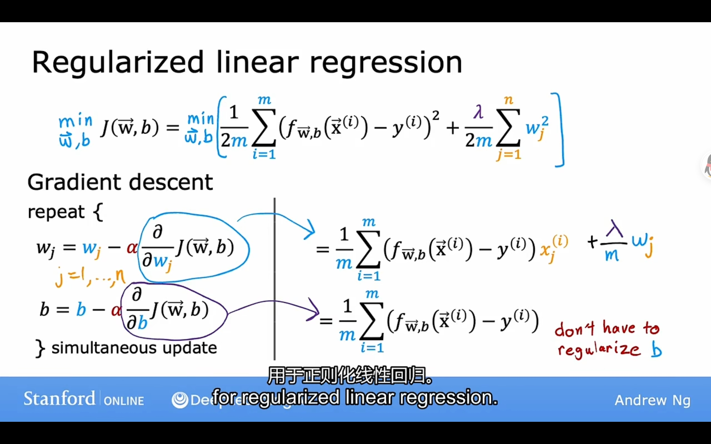

## 机器学习

#### 监督学习 supervised learning

1.监督学习是一种机器学习范式，其中算法从标记的数据中学习，这些数据包括输入和相应的目标输出或标签。

2.典型的监督学习任务包括分类和回归。在分类任务中，算法尝试将输入数据分为不同的类别或标签，而在回归任务中，算法尝试预测一个连续值。

3.学习一个函数，该函数将输入映射到正确的输出

#### 非监督学习 unsupervised learning

1.机器学习范式，算法从未标记的数据中学习，这意味着数据没有明确的目标输出或标签。

2.探索数据内在结构、识别模式、聚类相似数据点和减少数据的维度。

3.典型非监督学习任务包括聚类、降维和关联学习在，聚类任务中，算法试图将数据点分为不同的组，而在降维任务中，它们尝试减少数据的特征或维度以提取有用的信息。

4.客户细分、主成分分析/PCA和关联规则挖掘

### 线性回归

监督学习中回归算法

x：输入，特征

y: 输出，目标函数

J(w)：来表示代价函数（cost function）或损失函数（loss function）。代价函数是一个关于模型参数（通常表示为w）的函数，它度量了模型的性能，即模型的预测与实际观测之间的差异。目标是通过调整参数w来最小化代价函数，以使模型的预测尽可能接近实际观测值。

$\operatorname{MSE}=\frac{1}{n}\sum\limits_{i=1}^n(y_i-\hat{y}_i)^2$

cost function 平方误差成本函数或者代价函数

模型/参数/损失函数/目的

**通过使最小化损失函数来计算出w、b的值**


线性回归的目的是找到参数使得代价函数尽可能的小

梯度下降是一种用来尝试最小化任何函数的算法

$w=w-α\frac{d}{d w}J(w,b)$

α：学习率，取值范围为0-1，表示梯度下降的步伐

过大的学习率可能导致模型不收敛，而过小的学习率可能导致训练过于缓慢

线性回归函数、成本函数、线性回归的梯度下降算法

线性回归梯度算法的数学推导式


$w=w-α\frac{d}{d w}J(w,b)$

梯度下降算法最终结果式：
$w=w-\alpha\frac{1}{m}\sum_{i=1}^{m}(f_{w,b}(x^{(i)})-y^{(i)})x^{(i)}$

$b=b-\alpha\frac{1}{m}\sum_{i=1}^{m^{}}(f_{w,b}(x^{(i)})-y^{(i)})$

注：每次梯度下降之后倒数会发生变化是因为w,b也发生了改变，成本函数也发生改变

#### 多元线性回归/multiple linear regression


#### 向量化/using vectorization

多元线性回归通过向量化简化公式并加快运行速度（通过计算机硬件本身？）

$f_{\vec{w},b}(\vec{\mathbf{x}})=\sum_{j=1}^{n}w_{j}x_{j}+b$

~~~python
# 线性方程代码实现
f = 0
for i in range(0,n):
	f = f + w[j]*x[j]
f = f + b
# Vectorization 向量化
# 点积运算
f = np.dot(w,x) + b
~~~

#### 特征缩放

特征缩放方法有除以最大值和均值归一化/Mean normalization（取值范围一般为-1~1）和重新缩放Z-score normalization

均值归一化：首先要计算均值$\mu $

${x_1}=\frac{x_1-\mu_1}{\max-\min}$

重新缩放Z-score normalization；正态分布？

不同特征之间的范围尽量接近，量级相同

正确的学习曲线


学习率太大可能会导致学习率曲线上下波动示意图如下： 

##### 特征工程/Feature enginering

特征方程是指在机器学习和统计建模中，通过创建新的特征（特征工程）或者转换原有的特征，来改善模型的性能。特征方程的目标是提取数据中的有用信息，减少噪音，或者使数据更适合特定的模型。这包括特征选择、特征变换、特征合成等方法。特征方程是一个创造性和重要的过程，可以在建模过程中起到关键的作用，以提高模型的准确性。

##### 多项式回归

多项式回归是一种回归技术，用于拟合非线性数据。多项式回归是一种建模方法，用于拟合非线性关系。它们可以结合使用，以构建更复杂的回归模型，以适应不同类型的数据。

多项式回归允许使用多项式函数来拟合数据，这些多项式函数具有高次项。多项式回归的模型可以表示为：z

y = β₀ + β₁x + β₂x² + β₃x³ + ... + βₖxᵏ + ε

其中，y 是因变量，x 是自变量，β₀, β₁, β₂, ..., βₖ 是模型参数，k 是多项式的次数，ε 是误差项。

### 逻辑回归

逻辑回归的基本思想是将线性回归模型的输出通过一个称为“逻辑函数”或“S形函数”的激活函数，将其映射到0和1之间，从而实现二元分类。

$g(z)=\frac{1}{1+e^{-z}}$


逻辑回归模型


loss函数定义和平方误差损失函数用于该逻辑回归不合适


logistic loss function:不同于线性回归的平方误差成本函数

$L\big(f_{\overline{W},b}\big(\vec{x}^{(i)}\big),y^{(i)}\big)=\begin{cases}-\log\Big(f_{\overline{W},b}\big(\vec{x}^{(i)}\big)\Big) & \text{if }y^{(i)}=1\\ -\log\Big(1-f_{\overline{W},b}\big(\vec{x}^{(i)}\big)\Big) & \text{if }y^{(i)}=0\end{cases}$

简化逻辑回归代价函数的原理和公式

$\begin{aligned}J(\vec{\mathbf{w}},b) & =-\frac{1}{m}\sum_{i=1}^{m}\left[y^{(i)}\mathrm{log}\left(f_{\vec{w},b}(\vec{\mathbf{x}}^{(i)})\right)+(1-y^{(i)})\mathrm{log}\left(1-f_{\vec{w},b}(\vec{\mathbf{x}}^{(i)})\right)\right]\end{aligned}$


梯度下降的逻辑和运算过程，注意w,b的值是同步更新的


梯度下降在逻辑回归和线性回归之间的区别

相同点：

- 监控梯度下降使其收敛/学习率？
- 向量化
- 特征缩放

不同点：

- 损失函数的不同，线性回归函数采用的是平方误差函数，逻辑回归采用的是另外一种基于似然函数的统计理论（不在梯度下降中）
- f函数不同，一个是线性函数，一个是sigmoid函数


##### 过拟合/overfitting


| 欠拟合 | just right | 过拟合 |
| :----: | ---------- | ------ |
|        |            |        |
| 高偏差 | 泛化       | 高方差 |

过拟合：模型为了拟合数据采取比较复杂的多项式，杂乱的特征和不充足的数据也可能会导致过拟合

获取更多的数据/Collect more data 

选择最有价值的特征（全部特征的子集）/ Select features-

通过减小某些large values的参数降低影响 / Reduce size of parameters - Regularization

### 正则化

正则化是一种用于控制机器学习模型复杂性以防止过拟合的技术

正则化通过在损失函数中引入额外的惩罚项，鼓励模型参数保持较小的值，从而提高模型的泛化性能。

在机器学习中，有两种主要类型的正则化：L1正则化和L2正则化。

L1正则化引入了参数的**绝对值之和**作为损失函数的一部分，通常表示为λ∑|w_i|，其中λ是正则化强度超参数。

L2正则化引入了参数的**平方和**作为损失函数的一部分，通常表示为λ∑w_i^2，其中λ是正则化强度超参数。

*正则化的目标是在最小化损失函数时，同时限制模型的复杂性/通过减小w参数的值，防止参数过于拟合训练数据。*

$\stackrel{m\mathrm{in}}{}_{\vec{\mathbf{w}},b}J(\overrightarrow{\mathbf{w}},b)=\stackrel{min_{\vec{\mathbf{w}},b}}{}\left[\frac{1}{2m}\sum_{i=1}^{m}\left(f_{\vec{\mathbf{w}},b}\big(\vec{\mathbf{x}}^{(i)}\big)-y^{(i)}\right)^2+\frac{\lambda}{2m}\sum_{j=1}^{n}w_{j}^2\right]$


##### 用于线性回归的正则化



##### 用于逻辑回归的正则化


### 神经网络


#### 单层感知机

神经网络中的每一层通常包括两个主要函数：线性变换（Linear Transformation）和激活函数（Activation Function）。这些函数的组合允许神经网络学习复杂的特征和表示，以执行不同的任务。

1. **线性变换（Linear Transformation）**：
   - 该函数对输入数据进行线性组合，通过权重和偏差来进行处理。对于某一层，线性变换的输出通常计算如下：
     $Z=XW+b$ 其中，*Z* 是线性组合的结果，*X* 是输入数据，W是权重矩阵，b 是偏差向量。
2. **激活函数（Activation Function）**：
   - 线性变换的结果通常通过激活函数进行非线性变换，以增加神经网络的表达能力。常见的激活函数包括：
     - **ReLU（Rectified Linear Unit）**：$A=max(0,Z).$。ReLU函数在*Z*大于零时返回*Z*，否则返回零。
     - **Sigmoid**：$g(z)=\frac{1}{1+e^{-z}}$。Sigmoid函数将*Z*映射到(0, 1)范围内，常用于二元分类。
     - **Tanh**：$A=\tanh(Z)$。Tanh函数将*Z*映射到(-1, 1)范围内，也用于分类问题。

在深度神经网络中，这些线性变换和激活函数的组合通常会多次堆叠在一起，以形成多个层。例如，一个标准的前馈神经网络（feedforward neural network）可能包括输入层、多个隐藏层和输出层。每个隐藏层都由线性变换和激活函数组成，以学习和表示不同的特征和模式。

#### 前向传播


#### 密集函数


导入激活参数到密集函数中，判断输出几个参数，创建向量，循环计算（提取参数，点积，sigmoid函数），输出激活

机器学习的矢量化：matmul为矩阵乘法


矩阵乘法 


单个损失函数和二元交叉di


#### 神经网络基本流程

1. **初始化网络参数**：首先，您需要初始化神经网络的权重和偏差参数。通常，这些参数是随机初始化的。

2. **前向传播**：通过前向传播，将输入数据通过神经网络的不同层传递，直到得到最终的输出。这涉及到线性变换和激活函数的应用，将输入数据转化为预测结果。

3. **计算损失函数**：根据模型的输出和实际标签，计算损失函数的值，它是一个度量模型性能的指标。

4. **反向传播**：通过反向传播算法，计算损失函数对于网络中所有参数的梯度。这包括对权重w和偏差b的梯度。

5. **梯度下降更新**：使用计算得到的梯度信息，使用梯度下降或其变种（如随机梯度下降、Adam等）来更新神经网络的权重和偏差。通常，这是通过以下方式完成的：

   - 新权重 = 旧权重 - 学习率 x 梯度
   - 新偏差 = 旧偏差 - 学习率 x 梯度

   这一步是训练的核心，通过不断调整参数，模型逐渐逼近最小化损失函数的点。

6. **重复迭代**：重复执行步骤2到步骤5，直到损失函数收敛到一个最小值或满足停止条件。通常，需要多次迭代才能达到理想的性能。

#### 激活函数的选择

sigmoid函数并不一定是最佳激活函数

缺点：计算复杂耗时、在某些情况下的成本函数下降很慢（损失函数导数为0）


隐藏层激活函数推荐设置为Relu函数

8]C$%JQD4IN`Q.png)

#### Softmax（Softmax函数）

一种用于多类别分类的激活函数，通常用于**神经网络的输出层**。它的作用是将一组数值转化为表示类别概率分布的形式，其中每个类别都有一个对应的概率值。Softmax函数通常用于多分类问题，其中每个输入可以被分为多个不同的类别。

Softmax函数的公式如下：

对于输入向量 z = [z1, z2, ..., zn]，Softmax函数的输出为一个具有n个元素的向量 y = [y1, y2, ..., yn]，其中：

yi = exp(zi) / Σ(exp(zj))，其中 j = 1 到 n。

softmax回归是逻辑回归的泛化


逻辑回归和softmax回归中损失函数的区别


Softmax函数的主要特点和用途包括：

1. 归一化：Softmax函数将输入向量中的每个元素（通常是模型的原始分数或得分）转化为概率值，确保它们的总和等于1。这使得它适用于多类别分类问题，其中每个类别的概率表示了该类别是正确答案的概率。
2. 输出类别概率：Softmax输出的每个元素表示了对应类别的估计概率，通常选择具有最高概率的类别作为模型的最终预测结果。
3. 整体训练：Softmax激活函数通常与交叉熵损失函数结合使用，以便在训练过程中最小化模型输出的概率分布与实际标签之间的差异。

Softmax函数在深度学习中广泛用于图像分类、自然语言处理中的词语分类、文本分类等多类别分类问题，因为它提供了一种直观的方式来表示多个类别的相对概率。在训练后，Softmax函数的输出可用于确定最有可能的类别，并进行预测。

softmax函数的代码实现（修改处为激活函数和损失函数）


修改代码实现降低softmax函数中四舍五入造成的误差


#### 卷积，池化和填充

卷积层（Convolution Layers）、池化层（Pooling Layers）和填充层（Padding Layers）是深度学习卷积神经网络（CNN）中常用的三种基本层次，它们有助于模型从图像等输入数据中提取特征。

1. **卷积层（Convolution Layers）**：
   - 卷积层是CNN的核心组件之一，用于检测输入数据中的特征。
   - 卷积操作涉及将一个滤波器（卷积核）与输入数据进行逐元素相乘，然后将结果求和，得到输出的一个值。
   - 卷积核滑动遍历整个输入数据，生成一个特征图，其中每个元素对应一个特征。
   - CNN中可以有多个卷积层，以便检测不同层次的特征。
2. **池化层（Pooling Layers）**：
   - 池化层用于减小特征图的尺寸，同时保留关键特征。
   - 最大池化和平均池化是常见的池化操作，分别选择池化窗口中的最大值或平均值来代表该区域。
   - 池化有助于减少计算负担，减小过拟合风险，并提取输入数据的关键特征。
3. **填充层（Padding Layers）**：
   - 填充层用于在输入数据的周围添加额外的数据点（通常是0），以便在卷积过程中保持输出特征图的尺寸。
   - 填充可以是“有效填充”（valid padding，不添加额外数据）或“相同填充”（same padding，添加足够的数据以保持尺寸不变）。
   - 填充在卷积层中经常使用，以控制输出特征图的大小。

这三种层次通常在CNN中交替使用，以构建深度神经网络，逐渐提取和组合输入数据的特征。卷积层用于检测各种局部特征，池化层用于减小数据量和提取最重要的信息，填充层用于控制特征图尺寸。这些层次的组合形成了CNN的基础结构，使其能够有效地处理图像分类、目标检测和其他视觉任务。


#### Adam：Adaptive Moment estimation

自适应矩阵估计：自动调节学习率，比梯度下降更加好


#### 神经网络

1.数据预处理

将图片或者文本转化为tensor数据类型/张量

数据集下载

test_data = torchvision.datasets.CIFAR10("./dataset",train = False, transform=torchvision.transforms.ToTensor())

数据集加载

test_loader  =  DataLoader(dataset=test_data , batch_size = 4 , shuffle=True)

```python
import torch
from torchvision import transforms
from PIL import Image  # 用于处理图像的库

# 定义图像文件的路径
image_path = 'path/to/your/image.jpg'

# 创建一个转换管道(一系列数据处理操作)，其中包括ToTensor转换
transform = transforms.Compose([
    transforms.ToTensor()
])

# 打开图像文件
# 先转化为PIL格式的图片
image = Image.open(image_path)

# 应用转换
tensor_image = transform(image)

# 批量处理

# 现在，tensor_image 包含了JPEG图像的PyTorch张量表示

# PIL图像或NumPy数组
# 也可以先使用opencv库转化 pip install opencv-python 
import cv2
import torch
from torchvision import transforms

# 定义图像文件的路径
image_path = 'path/to/your/image.jpg'

# 使用OpenCV加载图像
image_cv = cv2.imread(image_path)

# 转换图像为PyTorch张量
transform = transforms.ToTensor()
tensor_image = transform(image_cv)

# 现在，tensor_image 包含了JPEG图像的PyTorch张量表示


```

eval()方法神经网络进入评估模式

常用的transforms函数

dataset，dataloader，totensor

tensorboard：可视化过程

dataset

dataloader 将数据集加载到神经网络中

2.
